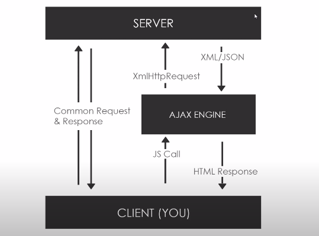

## What is AJAX?
- Asynchronous JavaScript & XML.
- Set of web technologies.
- Send and recieve data asynchronously.
- Doesnot interfere with current web page.
- JSON has replaced XML for the most part.

    

## XmlHttpRequest (XHR) Object
- API in the form on an object.
- Provided by the browser's JS environment.
- Methods transfer data between client/server.
- Can be used with other protocols than HTTP.
- Can work with data other than XML (JSON, plain text).

## Libraries and Other methods
- jQuery
- Axios
- Superagent
- Fetch API
- Prototype
- Node HTTP