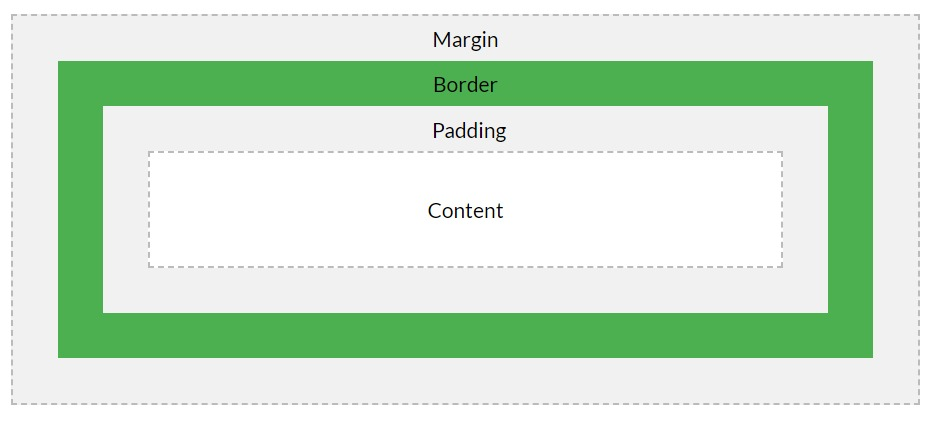

Intro to CSS

# What is CSS?
- Cascading Style Sheets - language to style and lay out webpages.
- Can use to style things like font, color, spacing, layout of page, animations.
- Language for styling your document and determining how it is presented.

# How can we alter the appearance of HTML with CSS?
- Web browser looks for CSS rules
- ### What's a CSS rule?
  - Selector - essentially 'selects' the HTML element(s) you want to style 
  - Properties - properties which you want to change.

# CSS Declarations
- Where you set the CSS properties to specific values.

```CSS
some-element{
    background-color : rgb(0, 0, 255); /* #0000ff */
    property-name : property-value;
}
```

# CSS Box Model
- Each element in an HTML document can be considered as a rectangular box.
- The standard box model describes the space an element takes up
- Each box has four edges: margin, border, padding, content edges


# CSS Specificity
- Specificity is super important with CSS
  0. Type Selectors (e.g. h1, div, header, p)
  1. Class selectors (e.g. .example-class)
  2. id selectors (e.g. #example)