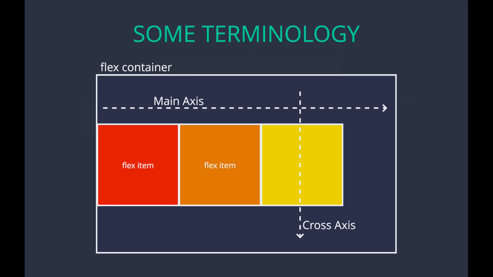

## What is Flexbox?
"It's a more efficient way to layout, align, and distribute space among items in a container."

## Container properties:
- flex-direction
- justify-content
- flex-wrap
- align-items
- align-content

## Flex item properties:
- order
- flex
- flex-grow
- flex-shrink
- align-self

## Some terminologies:


## Flex direction:
This is for direction of main axis.
Specifies how items are places in the flex container, defining the main axis and its direction. Its default value is:
```css
flex-direction: row;
```

## Flex wrap
specifies whether items are forced into a single line OR can be **wrapped into multiple lines**
this is for direction of cross axis.

## Justify content
defines how space is distributed between items in flex container **Along the main axis**

## Align-items
defines how space is distributed between items in flex container **Along the cross axis**
default value is:
```css
align-items: stretch;
```

## Align content:
defines how space is distributed between rows in flex container **Along the cross axis**

## Align self:
allows you to override align-items on individual flex items

## flex:
defines how a flex item will grow or shrink to fit the available space in a container.
*(it's actually a shorthand property for 3 other properties)*

flex: <'flex-grow'> <'flex-shrink'> <'flex-basis'>

## flex-basis
Sort of like width, but not 
specifies the ideal size of a flex item before it's placed into a flex container.

## flex-grow
- Dictates how the unused space should be spread amongst flex items
(can be applied to one box at a time)
- Its value is in the form of ratios. A certain ratio of the empty space left.

## flex-shrink
= Dictates how items should shrink when there isn't enough space in container.

## order 
specifies the order used to lay out items in their flex container.
Default value of order is zero.